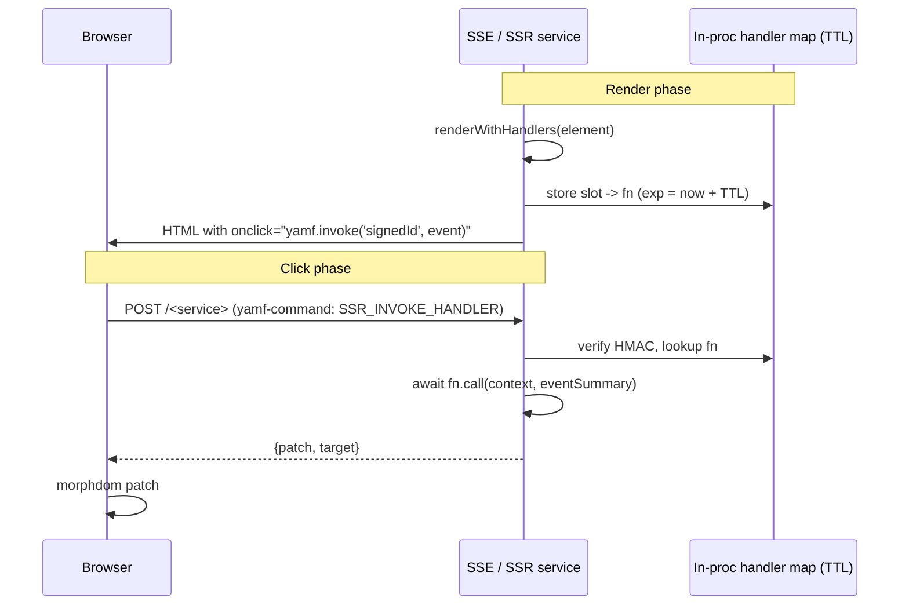

# YAMF — Rolling k3s Deployment & Follow‑on Work

Living document. The original phased rollout (Phases 1–6) landed; what remains here is:

1. A short "what shipped" summary for orientation.
2. Active follow‑on work (cleanup, features).
3. Deferred items we've chosen not to plan in detail yet.

---

## What shipped

Rolling k3s support is implemented end‑to‑end. Concretely:

- **Soundclone parity**: `@yamf/services-cache@0.1.4` (fixed bound `del`) and `@yamf/services-user@0.2.1` (invite `expiresIn`, defensive `registerWithToken`, hardened `isTokenExpired`, opt‑in PostGIS geography writes).
- **Auth keypair persistence**: `createAuthService` accepts `keyDir` / env overrides / `ephemeral` and persists ed25519 keypairs under `${YAMF_HOME}/auth/`. Tokens include `kid`.
- **Multi‑session auth**: per‑token cache entries (`refresh:${tokenId}`, `access:${tokenId}`), `maxSessionsPerUser`, `sessionMetadataFn`, configurable access/refresh expiries. `logoutAll` supported.
- **CLI `restart` count fix** and `pollUntilNoNewServices` no longer gated by `lastLength > 0`. PM3 env tunables exposed.
- **Centralized lifecycle**: `process-lifecycle.js` owns the single `SIGTERM`/`SIGINT` pair. Services register via `lifecycle.registerTerminable(fn, { priority })`. Registry/gateway drain last (priority `0`), services drain first (priority `10`).
- **Registry‑initiated `SERVICE_SHUTDOWN`**: `broadcastShutdown` fans out `SERVICE_SHUTDOWN` (registry token validated on the service side) before the registry closes its HTTP server.
- **Dual‑registry drain handshake**: `REGISTRY_DRAIN` between peers via `YAMF_REGISTRY_URL`. Draining registry rejects `SERVICE_SETUP` / `SERVICE_REGISTER` with `503 Retry-After` while continuing to serve `SERVICE_CALL`, `SERVICE_LOOKUP`, `SERVICE_UNREGISTER`, `REGISTRY_PULL`, `HEALTH`, and pub/sub. `HEALTH` now reports `draining: boolean`.
- **Gateway startup readiness gate**: gateway polls registry `HEALTH` and only pulls full state from a non‑draining peer. A fresh registry pings the preregistered gateway on startup to force an immediate re‑pull (closes the k3s DNS‑race window).
- **CLI polish**: `yamf restart --rolling <target>`, `yamf drain`, `yamf status --health`.
- **k3s manifest**: rolling strategy with `maxUnavailable: 0 / maxSurge: 1`, `terminationGracePeriodSeconds: 30`, auth key volume mounted at `/app/.yamf`.

Regression coverage lives in `packages/core/tests/cases/rolling-registry-tests.js` and `packages/cli/src/tests/cli-rolling-commands.js`.

### Relevant env knobs

| Env var | Default | Meaning |
|---|---|---|
| `YAMF_GRACEFUL_SHUTDOWN_MS` | `15000` | Lifecycle timeout per terminable. |
| `YAMF_DRAIN_MS` | `3000` | Drain grace a registry advertises via `Retry-After` on 503. |
| `YAMF_SHUTDOWN_BROADCAST_TIMEOUT_MS` | `2000` | Per‑service wait for `SERVICE_SHUTDOWN`. |
| `YAMF_REGISTRY_DRAIN_HANDSHAKE_MS` | `8000` | Startup handshake timeout to an existing peer. |
| `YAMF_GATEWAY_READY_WAIT_MS` | `10000` | Gateway's initial wait for a non‑draining registry. |
| `YAMF_GATEWAY_READY_POLL_MS` | `250` | Gateway's health‑poll interval during startup. |
| `YAMF_REGISTRATION_RETRY_LIMIT` | `120` | Service registration retries (bridges a registry gap). |
| `YAMF_RETRY_DELAY` | `100` | Initial backoff for retrying registrations. |
| `YAMF_PM3_POLL_MAX_ATTEMPTS` | `150` | CLI `pm3` startup polling cap. |
| `YAMF_PM3_POLL_INTERVAL_MS` | `200` | CLI `pm3` startup polling interval. |
| `YAMF_PM3_POLL_STABLE_CHECKS` | `3` | Consecutive stable snapshots before declaring ready. |
| `YAMF_SSR_HANDLER_TTL_MS` | `600000` | Lifetime of a signed SSR handler id. |
| `YAMF_SSR_HANDLER_MAX` | `10000` | Max live SSR handlers before LRU eviction. |
| `YAMF_SSR_HANDLER_SWEEP_MS` | `60000` | SSR handler TTL sweep interval. |

---

## Active follow‑on work

Planned slice order. Each slice is independently shippable.

### Slice 1 — File server: first‑class SPA mode + security fix

Goal: SPAs drop their custom `spaFallbackResolver` and `customSecurityCheck` shims and work out‑of‑the‑box. Multi‑tenancy stays "run multiple file services" (no runtime `rootResolver` — that escape hatch is explicitly out of scope).

Files:

- `packages/services/file-server/service.js` — new `spa` option; segment‑based `simpleSecurityCheck`.
- `packages/services/file-server/tests/` — SPA fallback, `/library` no‑longer‑403, excluded prefix/extension behavior.
- `packages/services/file-server/README.md` — SPA section.
- `packages/services/file-server/package.json` — bump 0.1.2 → 0.2.0 (semantics tighten).

API:

```js
await createStaticFileService({
  rootDir: './public',
  fileMap: { '/': 'index.html', '/assets/*': 'assets' },
  spa: {
    entry: 'index.html',                    // relative to rootDir
    excludePrefixes: ['/audio', '/images', '/u', '/@yamf/', '/api'],
    excludeExtensions: true,                // /foo.png still 404s; /some/route falls back to entry
  }
})
```

Semantics:

- When the request misses `quickLookup` and passes both exclusion tests, serve `entry` with `content-type: text/html`. Relies on the already‑fixed Buffer/content‑type handling in `packages/core/src/http-primitives/http-server.js` line 99.
- Supersedes the `'/*': 'index.html'` convention; legacy catch‑all still works but logs a deprecation notice.

Security fix: replace `url.includes('/lib')` substring matches in `simpleSecurityCheck` with whole‑segment comparisons (`url.split('/').some(seg => systemDirs.has(seg))`). Keeps encoded‑traversal checks (`%2e`, `\\`) as‑is.

### Slice 2 — SSE & subscription channel handlers: `this === context`

Goal: channel handlers can `await this.call('peer-service', …)` and stay cache‑aware across late peer registrations.

Files:

- `packages/core/src/api/create-subscription-service.js` — wrap each channel handler with `bindServiceFunction(handler, context)` (already imported) before `pubSubManager.subscribe`.
- `packages/core/src/api/create-event-source-service.js` — confirm `handler.call(context, …)` in the channels path; also bind `onConnect`/`onDisconnect`.
- `packages/core/tests/cases/rolling-registry-tests.js` — regression: subscribe to `foo:bar`, register `late-peer` afterwards, publish, assert handler can `this.call('late-peer', …)`. Same for an SSE service invoking the late peer from `onConnect`.
- `packages/core/package.json` — bump 0.5.0 → 0.5.1.

### Slice 3 — Interactive SSR of client events (signed‑handler RPC)

Goal: `button({onclick: serverFn}, 'x')` renders on the server; the browser click round‑trips to the server; the server returns an HTML fragment that morphdom patches into a target selector. No per‑user server session: handlers are bound via HMAC‑signed short‑lived ids (HTMX‑style stateless binding).

Flow:



Design commitments:

1. **Render‑context isolation.** Today `yamf.__nextListenerId__` is process‑global (`packages/client/src/client-init.js` line 18). Concurrent SSR renders collide. Introduce a per‑render `RenderContext` with its own slot counter and listener map, passed through `Element.addEventListener` via an AsyncLocalStorage slot (or an explicit argument to a new `renderWithHandlers` helper). Backwards compatible: existing `element.render()` falls back to the global registry.

2. **Signed handler ids.** Format `v1.<base64url(payload)>.<base64url(hmac)>`, payload `{ slot, exp, kid }`. HMAC‑SHA256 over a per‑service secret derived from the service's ed25519 keypair (see `packages/core/src/shared/crypto.js` and the existing auth‑key persistence work). Rotating keys rotates signing automatically; `kid` lets the server accept ids signed under a recently‑retired key during rollout.

3. **Handler map.** Per‑service `Map<slot, { fn, exp }>`. TTL default 10 min (`YAMF_SSR_HANDLER_TTL_MS`). Sweep every `YAMF_SSR_HANDLER_SWEEP_MS`. Cap `YAMF_SSR_HANDLER_MAX` entries (default 10 000) with LRU eviction on overflow. On miss or expiry: respond `410 Gone` with `{ refresh: true }` so the client can re‑render the view.

4. **New `@yamf/client/ssr-render` module** (`packages/client/src/ssr-render.js`, re‑exported from `packages/client/src/index.js`):

   ```js
   const registry = createHandlerRegistry({ signer, ttlMs, maxEntries })
   const { html, nSlots } = renderWithHandlers(element, registry)
   // registry.invoke(signedId, eventSummary) -> fn return value
   ```

   Implementation detail: a small edit in `packages/client/src/Element.js` `renderListeners` (lines 68-102) accepts a `mintId(slot) => string` injected via the active render context; when present, inline emit changes from `yamf.__listeners__[N](event)` to `yamf.invoke('<signedId>', event)`.

5. **Server HTTP endpoint.** `createEventSourceService` grows a POST branch before the SSE branch. `yamf-command: SSR_INVOKE_HANDLER` (new constant in `packages/core/src/shared/yamf-headers.js`) carries `{ id, event }`. Server:
   - Verifies HMAC, extracts `slot`, checks TTL.
   - Looks up `fn`, invokes `await fn.call(context, event)`.
   - Handler return shapes:
     - `Element` → rendered; target pulled from `data-yamf-target` attribute or explicit `{ element, target }` envelope.
     - `{ patch, target }` literal → passed through.
     - `null` / `undefined` → 204 No Content.

6. **Event summary (wire‑safe).** The browser never sends a raw `Event`. Bootstrap serializes:

   ```js
   { type, targetSel, value, checked, keyCode, dataset }
   ```

   `targetSel` is a minimal selector derived from `event.target` (`tag#id` or `tag[data-yamf-target]` or a generated stable attribute). This keeps the wire payload bounded and auditable.

7. **Client bootstrap `@yamf/client/ssr-hydrate`** (`packages/client/src/ssr-hydrate.js`):
   - Exposes `window.yamf.invoke(signedId, event)`; serializes into the summary above, POSTs to the endpoint configured via `<meta name="yamf-ssr-endpoint" content="/track-events">`, applies response via `patch-dom.js`'s existing helpers (`beginListenerGeneration` + morphdom).
   - Listens for the `render` SSE event and applies `{patch, target}` frames pushed from `server.broadcastRender(...)`.
   - Added to `packages/client/src/index.js` barrel.

8. **SSE service wiring.**

   ```js
   await createEventSourceService('track-events', {
     channels: {
       'yamf:file-updated': async function(data, clients) {
         const el = renderTracks(await this.call('track-service', { list: {} }))
         this.broadcastRender(el, { target: '#tracks' })
       }
     }
   }, { renderMode: 'html-handlers' })
   ```

   `server.broadcastRender(element, { target })`: renders through the service's `handlerRegistry`, wraps as `{ patch, target }`, sends as SSE `event: render`. Client's `ssr-hydrate` applies it.

9. **Auth.** If `useAuthService` gates the SSE connection, the invoke endpoint requires the same auth token. Handlers can inspect `context.user` (set from the auth service during token verification) to scope behavior.

10. **Failure modes.**
    - Expired / forged id → `410 { refresh: true }`.
    - Handler throws → `500 { error }`; client logs and optionally surfaces.
    - Handler map at cap → oldest slot LRU evicted; its future clicks 410.
    - Service restart → all signed ids invalidate (keypair may be preserved, but the in‑proc map is gone). Client refreshes.

Sub‑slicing if this lands in chunks:

- **3a**: render‑context isolation + `@yamf/client/ssr-render`. No RPC yet.
- **3b**: `SSR_INVOKE_HANDLER` endpoint + `ssr-hydrate` + `broadcastRender`.

Version bumps at completion of slice 3: `@yamf/client` 0.0.7 → 0.1.0, `@yamf/core` 0.5.1 → 0.6.0.

### Slice 4 — Soundclone migration chores (follow‑up repo)

No changes in this YAMF PR. Tracked here so we don't lose them after slices 1-3 land:

- Remove `spaFallbackResolver` and the stale content‑type comment at `soundclone/src/app/app.js` lines 467-485; use `spa: { entry: 'index.html', excludePrefixes: [...] }`.
- Remove `spaStaticFileSecurityCheck` + TODO block (lines 281-340); switch back to `simpleSecurity: true`.
- Replace `soundclone/src/app/services/track-events-sse.js` and the ad‑hoc `track-events-sub` subscription (`app.js` lines 230-238) with `createEventSourceService('track-events', { channels: {...} }, { renderMode: 'html-handlers' })`. Server‑render track list fragments on `yamf:file-updated` / `waveformComplete` and broadcast via `broadcastRender`.

### Slice 5 — Plan doc refresh

Already applied to this file (this section).

### Lower‑priority cleanup (tracked, not blocked on slices 1-3)

- `createService` and `createSubscriptionService` both branch into a pure variant with duplicate lifecycle plumbing. Extract `createLocalService({ name, handler, access, cache, context, pubSubManager? })` so public factories only describe type‑specific bits.
- `createService`'s `pureServiceWrapper` can drop the `undefined` sentinel once `before()` is first‑class on `createPureService`.
- `createPureSubscriptionService` double‑logs "Pure subscription service … registered" on the `local-logger` path; collapse.
- `notifyRegistryOfPureService` silently returns `null` on failure; either bubble up or add explicit `suppressRegistryWarning`.

---

## Deferred (tracked, not planned in detail)

### Soundclone S3 lazy init
Swap synchronous S3 bring‑up for lazy‑on‑first‑call. Expected side benefit: fixes `yamf start` startup flakiness since services no longer block on S3.

### Local FS expiration / resync system
Companion to the S3 lazy init. Cache eviction policies, S3‑of‑record reconciliation, orphan cleanup. Needs its own design pass.

---

## References

- `packages/core/src/shared/process-lifecycle.js`
- `packages/core/src/registry/registry-drain-handshake.js`
- `packages/core/src/registry/registry-server.js`
- `packages/core/src/registry/service-registry.js` (`broadcastShutdown`)
- `packages/core/src/registry/command-router.js`
- `packages/core/src/gateway/gateway-server.js` (startup readiness gate)
- `packages/core/src/service/cache-handler.js`
- `packages/core/src/api/create-service.js`
- `packages/core/src/api/create-subscription-service.js`
- `packages/core/src/api/create-event-source-service.js`
- `packages/core/src/shared/yamf-headers.js`
- `packages/cli/src/lib/pm3.js`
- `packages/cli/src/commands/{restart,drain,status}.js`
- `packages/core/tests/cases/rolling-registry-tests.js`
- `packages/cli/src/tests/cli-rolling-commands.js`
- `packages/services/file-server/service.js` (slice 1)
- `packages/client/src/Element.js` (slice 3 render‑context + listener emission)
- `packages/client/src/client-init.js` (slice 3 global `__listeners__` registry)
- `packages/client/src/patch-dom.js` (slice 3 morphdom hook for SSR patches)
- `packages/client/src/event-source.js` (slice 3 client‑side SSE receiver)
- `soundclone-deployment/k3s/deployment.yaml`
- `soundclone-deployment/soundclone/src/app/app.js` (slice 4 migration targets)
- `soundclone-deployment/soundclone/src/app/services/track-events-sse.js` (slice 4 replace)
